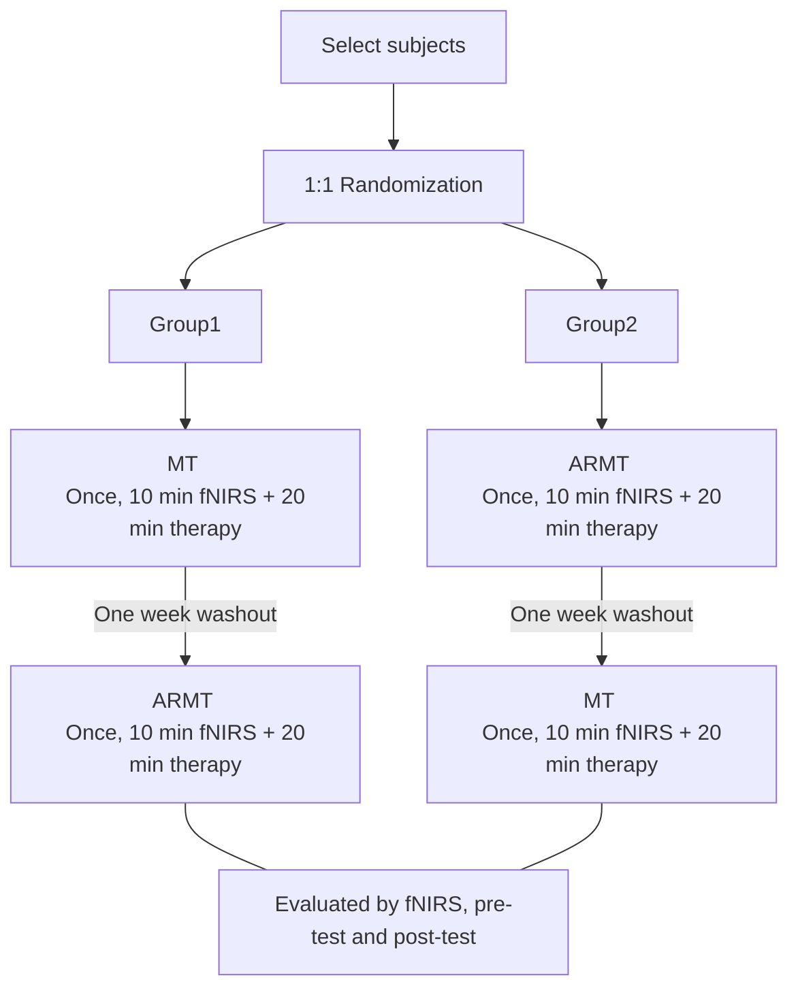
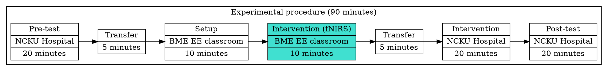
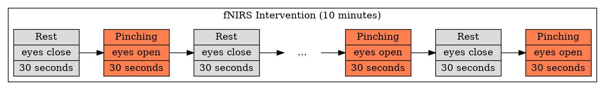

# ARMT invervention experiment flow (Healthy subject) 

[Read me Online](https://hackmd.io/@maromaSamsa/r14l1sSeo)

## Objective: 

Compare the upper limb rehabilitation performance of traditional mirror therapy and augmented reality mirror therapy (ARMT)

## Subject
:::info
Recruit from WTMH Lab and other BME lab member
:::

Find at least 10, at most 30 subjects to join the intervention experiment, All subjects should be **right-handed and should be unfamiliar with the mirror therapy**. subjects did not have musculoskeletal or neurological defect and did not have visual impairment.

## Rehearsal
:::info
**Site**: Electrical engineering classroom
:::
 - Check the place experiment take, set up fNIRS, run through the software and collect the raw data. 
 - If fNIRS is not been used in the period by other labs, left it to stand by in the electrical engineering classroom.

### Selected date
- [ ] **2022/9/13 ::: 13:10 - 17:00**
- [ ] **2022/9/14 ::: 13:10 - 17:00**
- [ ] **2022/9/16 ::: 13:10 - 17:00**
> Discuss with professor Su's Lab which day is prefer.

## Period of formal intervention
:::warning
This schedul have **not** discuss with professor Su yet, may be changed in the future
:::
---

**September 2022**
- [ ] 9/20 (W2)
- [ ] 9/21 (W3)
- [ ] 9/27 (W2)
- [ ] 9/28 (W3)
- [ ] 9/30 (W5)

**October 2022**
- [ ] 10/4 (W2)
- [ ] 10/5 (W3)
- [ ] 10/7 (W5)
- [ ] 10/11 (W2)
- [ ] 10/12 (W3)
- [ ] 10/14 (W5)
- [ ] 10/18 (W2)
- [ ] 10/19 (W3)
- [ ] 10/21 (W5)
- [ ] 10/25 (W2)
- [ ] 10/26 (W3)
- [ ] 10/28 (W5)

:::info
**[Time: 13:10 - 17:10]**
**[At: Electrical engineering classroom]** 
**[Two subjects per day]**

 - **At least choose 10 day, 10 subject**, each healthy subject will have twice intervention, one is traditional mirror therapy, the other one is ARMT.
 - The interval between the two intervention times needs to be **more than one week**, as the cleaning period.
:::

---

## Intervention

### Select subjects
:::info
Recruit from WTMH Lab and other BME lab member
:::

Find at least 10, at most 30 subjects to join the intervention experiment, All subjects should be **right-handed and should be unfamiliar with the mirror therapy**. subjects did not have musculoskeletal or neurological defect and did not have visual impairment.

### Evaluation 
#### Pre-test and post-test
:::success
This part will be handled by Dr. Xu
:::
1. Pinch-holding-up-activity test, PHUA test
2. Semmes-Weinstein monofilament, SWM
3. Two-point Discrimination Test, 2PD)
4. Purdue Pegboard Test
5. Minnesota Manual Dexterity Test, MMDT

#### fNIRS
According to the literature research and Dr. Xu's IRB proposal, the following cortex regions will be selected:
1. brain prefrontal cortex
2. premotor cortex
3. primary motor cortex
4. supplementary motor cortex
5. sensorimotor cortex
6. secondary sensory cortex

https://github.com/maromaSamsa/fNIRS-experiment/blob/main/fOLD/fOLD.png
> The fNIRS chennel will be set with reference to this chart

https://github.com/maromaSamsa/fNIRS-experiment/blob/main/fOLD/fOLD.png
> Subject schematic

### Intervention schedule for single subject
Each healthy subject will have **twice intervention**, one is the traditional mirror therapy, the other one is ARMT.

#### Experimental procedure
 - Pre-test will take place in NCKU Hospital Rehabilitation Department
 - Next, for the purpose of collecting fNIRS signal, there will have ten minutes intervention will take place in NCKU BME Electrical Engineering Classroom.
 - In the ten minutes recording fNIRS time, the subject will only be asked to perform finger pinching, **by their non-dominant hand**. 
 - Depending on the group to which they were assigned, subjects **were asked to observe with their eyes a mirrored hand (their dominant hand)** generated through a mirror or VR headset.
 - After finish recording, subject will back to NCKU Hospital Rehabilitation Department to do the post test.

> Each trail box switch between resting and pinching, triggered by an auditory cue.
> **In the resting state**, subjects will be asked to let their minds go empty with closing their eyes
> **During the pinching state**, the subjects were asked to observe their mirrored hand.

 

